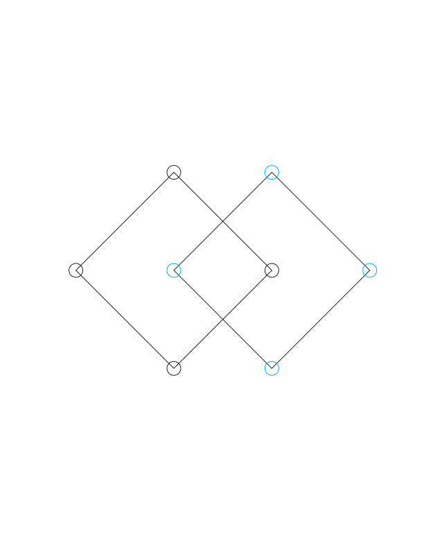
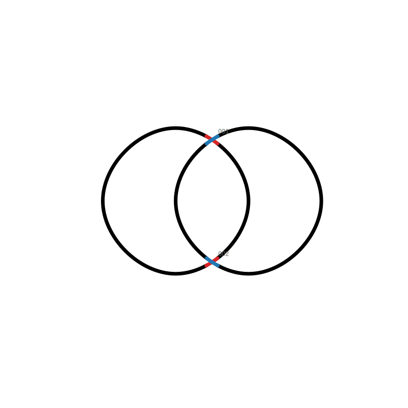
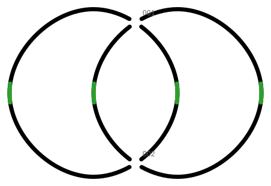
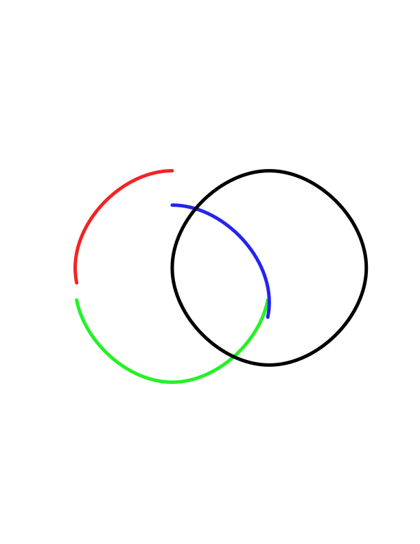
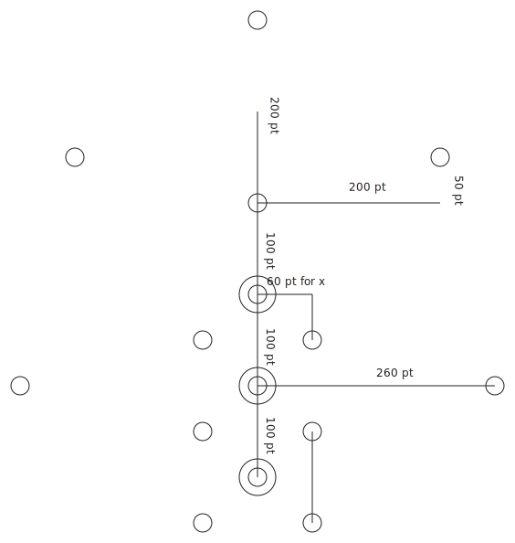

# SVG Curve Scripts Manual

This manual shows practical workflows for the scripts in this repository using the files in the `Example` folder.

Run commands from the repository root:

```bash
cd /path/to/svg-curve-scripts
```

## Example Files

| File | What it demonstrates |
| --- | --- |
| `Example/HL_circle.svg` | Two named circle groups, `ring2` and `ring1`, suitable for converting into two closed curves and then generating crossing-gap options. |
| `Example/TK1B_circle.svg` | One circle-anchor group, `Layer_2`, suitable for converting a longer ordered anchor sequence into one smooth closed curve. |

Both examples were exported from Adobe Illustrator and contain circles that act as anchor points. `svg_point2curveV3.py` reads the circle centers in SVG document order.

## Visual Overview

The main workflow is:

```text
circle anchor SVG -> smooth curve SVG -> crossing gaps or divided fragments
```

`HL_circle.svg` starts with two named groups of circle anchors:



After conversion, those anchors become two smooth closed curves:


The smooth curves can then be used to create editable crossing-gap options:



Direction guides can also be added for later arrowheads in Illustrator:



Or one curve can be divided into design-length fragments. The image below uses `--separate`, so the fragments are offset from each other for easier inspection:


V3 can also color each fragment with a different rainbow stroke color:



`TK1B_circle.svg` is a longer single anchor sequence:



After conversion, it becomes one smooth closed curve:


## Setup

Install the Python dependency:

```bash
python3 -m pip install -r requirements.txt
```

This installs `svgpathtools`, which is needed by `svg_curve_divV3.py`. The point-to-curve and crossing-gap scripts use only Python's standard library.

A virtual environment is optional. It can help keep Python packages isolated, but users do not need to create one to run the examples in this manual.

Tkinter is needed only for GUI mode. If GUI mode is unavailable in your Python installation, use the command-line examples below.

## Workflow 1: Convert Circle Anchors to Smooth Curves

Use `svg_point2curveV3.py` when an SVG contains circles marking the intended curve anchors.

Convert `HL_circle.svg` into two smooth closed curves:

```bash
python svg_point2curveV3.py Example/HL_circle.svg \
  --output Example/HL_curve.svg \
  --keep-svg-frame \
  --export-points-txt Example/HL_points.txt
```

Expected result:

- `Example/HL_curve.svg` contains two curve paths named `ring2` and `ring1`.
- `Example/HL_points.txt` records the parsed anchor coordinates.

The parsed `HL_circle.svg` point groups are:

```text
[ring2]
250.95, 248.6
109.53, 390.02
250.95, 531.44
392.37, 390.02

[ring1]
392.37, 248.6
250.95, 390.02
392.37, 531.44
533.79, 390.02
```

Convert `TK1B_circle.svg` into one smooth closed curve:

```bash
python svg_point2curveV3.py Example/TK1B_circle.svg \
  --output Example/TK1B_curve.svg \
  --keep-svg-frame \
  --export-points-txt Example/TK1B_points.txt
```

Expected result:

- `Example/TK1B_curve.svg` contains one curve path named `Layer_2`.
- `Example/TK1B_points.txt` records the anchor coordinates.

Useful options:

```bash
python svg_point2curveV3.py Example/HL_circle.svg --open --output Example/HL_open_curve.svg
python svg_point2curveV3.py Example/HL_circle.svg --show-points --show-handles --output Example/HL_debug_curve.svg
python svg_point2curveV3.py Example/HL_circle.svg --method catmull-rom --output Example/HL_catmull_rom.svg
```

Use `--open` when the curve should not return to its first point. The default is a closed curve.

## Workflow 2: Create Editable Crossing Gaps

Use `svg_crossing_gap_optionsV3.py` after converting circle anchors into curve paths.

First create the curve SVG:

```bash
python svg_point2curveV3.py Example/HL_circle.svg \
  --output Example/HL_curve.svg \
  --keep-svg-frame
```

Then create crossing-gap options:

```bash
python svg_crossing_gap_optionsV3.py Example/HL_curve.svg \
  --output Example/HL_crossing_gap.svg \
  --gap-radius-px 12 \
  --default-choice both
```

Expected result for `HL_curve.svg`:

- Input curves: 2
- Detected crossings: 2
- Output file: `Example/HL_crossing_gap.svg`

The output SVG contains editable groups:

- `original_graph_reference`: original continuous curves, hidden by default unless changed.
- `base_broken_strands`: curves with real gaps cut at crossings.
- `crossing_options`: candidate overpass pieces for each crossing.
- `crossing_labels`: optional crossing numbers.
- `direction_guides`: optional short curves for later arrowheads.

Add direction guides for Illustrator arrowheads:

```bash
python svg_crossing_gap_optionsV3.py Example/HL_curve.svg \
  --output Example/HL_crossing_gap_guides.svg \
  --gap-radius-px 12 \
  --add-direction-guides
```

Tips:

- Decrease `--sample-step-px` if a true crossing is missed.
- Increase `--gap-radius-px` if the visual gap is too small.
- Use `--default-choice a`, `--default-choice b`, or `--default-choice none` if you do not want both choices visible at first.

## Workflow 3: Divide a Curve into Fragments

Use `svg_curve_divV3.py` when you need editable curve fragments based on design lengths. V3 also supports `--color-fragments`, which gives each divided fragment a different rainbow stroke color.

Create a curve SVG first:

```bash
python svg_point2curveV3.py Example/HL_circle.svg \
  --output Example/HL_curve.svg \
  --keep-svg-frame
```

List the available paths:

```bash
python svg_curve_divV3.py Example/HL_curve.svg --list-paths
```

Expected path list for `HL_curve.svg`:

```text
[0] id=ring2 | segments=4 | SVG length=876.163643
[1] id=ring1 | segments=4 | SVG length=876.163643
```

Divide the first path into design-length fragments:

```bash
python svg_curve_divV3.py Example/HL_curve.svg \
  --path-index 0 \
  --total 40 \
  --lengths 11 18 \
  --output Example/HL_ring2_div.svg
```

In this example, the final fragment length is calculated automatically as `40 - 11 - 18 = 11`.

Use separated output for easier inspection:

```bash
python svg_curve_divV3.py Example/HL_curve.svg \
  --path-index 0 \
  --total 40 \
  --lengths 11 18 \
  --separate \
  --output Example/HL_ring2_div_separate.svg
```

Behavior of `--separate`:

- Default behavior without `--separate`: fragments stay aligned on the original curve, so the output can replace or overlay the original path.
- With `--separate`: fragments are moved apart in the chosen direction so each piece is easier to inspect and select.
- The geometry of each fragment is not changed by `--separate`; only its placement in the output SVG changes.
- Use `--separate-direction x` or `--separate-direction y` to choose the offset direction. The default is `y`.
- Use `--separate-spacing` to adjust the distance between separated fragments.

Color the divided fragments:

```bash
python svg_curve_divV3.py Example/HL_curve.svg \
  --path-index 0 \
  --total 40 \
  --lengths 11 18 \
  --color-fragments \
  --output Example/HL_ring2_div_color.svg
```

Combine color with separated output:

```bash
python svg_curve_divV3.py Example/HL_curve.svg \
  --path-index 0 \
  --total 40 \
  --lengths 11 18 \
  --separate \
  --color-fragments \
  --output Example/HL_ring2_div_separate_color.svg
```

Behavior of `--color-fragments`:

- Each divided fragment receives a rainbow stroke color, evenly distributed across the hue spectrum.
- The option changes the fragment stroke color only; it keeps other path attributes such as fill, stroke width, line cap, and line join.
- It works with both default aligned output and `--separate` output.
- Coloring is useful for checking the order and boundaries of generated fragments before editing them in Illustrator.

## GUI Mode

Each script can open a GUI:

```bash
python svg_point2curveV3.py --gui
python svg_curve_divV3.py --gui
python svg_crossing_gap_optionsV3.py --gui
```

You can also run a script with no arguments to open its GUI.

## Recommended File Practice

Keep original example inputs in `Example/` and write generated outputs with clear suffixes:

- `_curve.svg` for point-to-curve output.
- `_points.txt` for exported point coordinates.
- `_crossing_gap.svg` for editable crossing-gap output.
- `_div.svg` for divided curve output.
- `_div_color.svg` for divided curve output with `--color-fragments`.

For long-term versioning, prefer Git commits and release tags instead of adding new version numbers to filenames.
